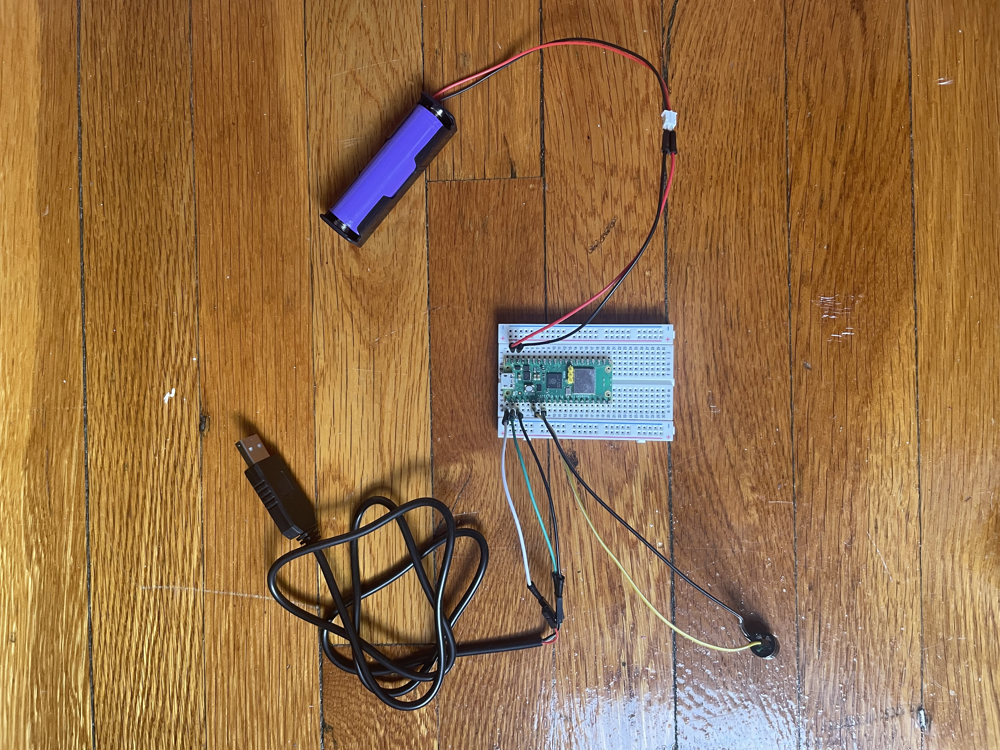

# piezo-cricket-chirper-rs
An embedded Rust example of a "cricket chirper" made with the Sunfounder Kepler Kit's piezo buzzer, raspberry pi, AA battery pack, and includes logging using an UART cable (sold seperately).

<video src="https://github.com/JimLynchCodes/piezo-cricket-chirper-rs/blob/main/piezo-buzzer-pi-example.MOV"></video>

[piezo-buzzer-pi-example.MOV](https://github.com/JimLynchCodes/piezo-cricket-chirper-rs/blob/main/piezo-buzzer-pi-example.MOV)

---

## Goal

The purpose of this project is to show an example of embedded, bare metal Rust (meaning we flash the final build file directly onto the board, with no separate operating system).

The project should run an infinite loop, and wait a random number of seconds between 1 and 60.

After those seconds go by, we want the piezeo buzzer to buzz, and we want soem logs to be printed to the serial output.

By default the raspberry pi pico is powered by the mini usb cable when you plug it in to flash it. As a bonus we'll show how to use the AA battery pack from the kepler kit.

---

## Longer Explanation Linkedin Article

Follow me here...

---

## Build Steps

build:
```
cargo build --release
```

convert to a .uf2 file:
```
elf2uf2-rs target/thumbv6m-none-eabi/release/pico-buzzer
```

Note: if you don't have elf2uf2-rs, it can be installed like this:
```
cargo install elf2uf2-rs
```

---

## Flashing Steps

Then follow the bootsel pi pico process for flashing new firmware:


### Flash to Pico:
1. Hold BOOTSEL button
2. Plug in USB
3. Copy firmware.uf2 to RPI-RP2 drive
4. Pico reboots and runs immediately

---

## UART Logging

find the correct file:
```
ls /dev/tty.usbserial*
```

then use `screen` to view the logs in real-time:
```
screen /dev/tty.usbserial-11111 115200
```

---

## Wiring Photo


